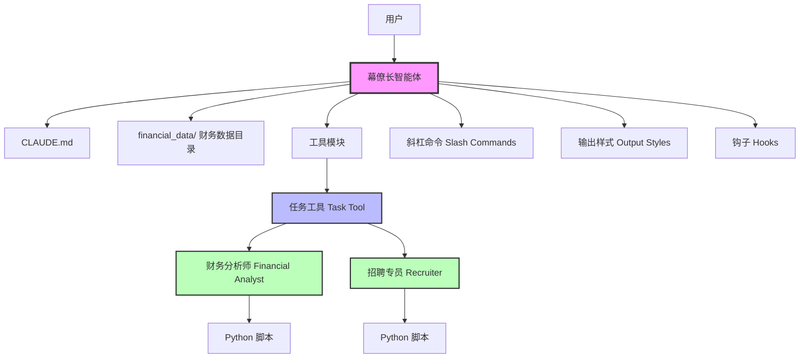
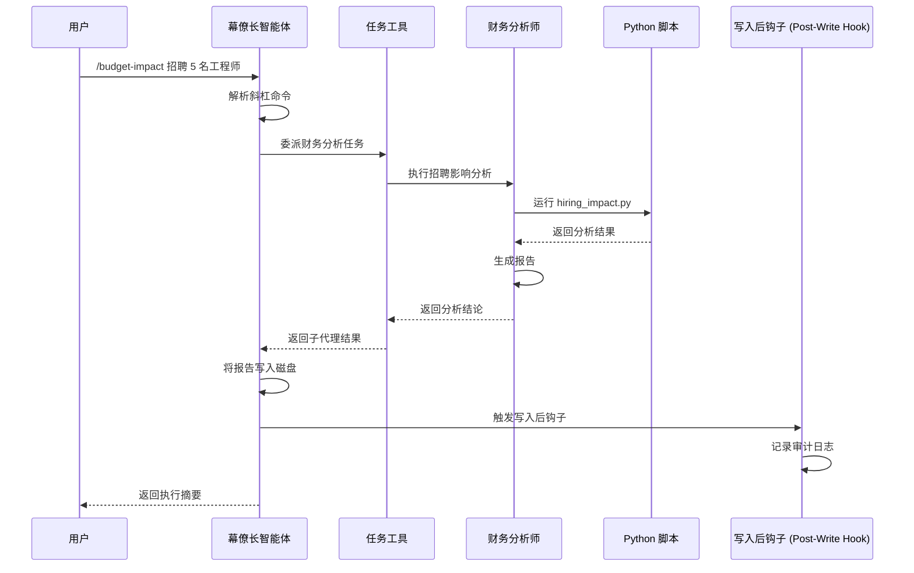

# 幕僚长智能体架构 (Chief of Staff Agent Architecture)

```mermaid
graph TD
    User[用户] --> Chief[幕僚长智能体]
    Chief --> Memory[CLAUDE.md]
    Chief --> FinData[financial_data/ 财务数据目录]
    Chief --> Tools[工具模块]
    Chief --> Commands[斜杠命令 Slash Commands]
    Chief --> Styles[输出样式 Output Styles]
    Chief --> Hooks[钩子 Hooks]

    Tools --> Task[任务工具 Task Tool]
    Task --> FA[财务分析师 Financial Analyst]
    Task --> Recruiter[招聘专员 Recruiter]

    FA --> Scripts1[Python 脚本]
    Recruiter --> Scripts2[Python 脚本]

    style Chief fill:#f9f,stroke:#333,stroke-width:3px
    style Task fill:#bbf,stroke:#333,stroke-width:2px
    style FA fill:#bfb,stroke:#333,stroke-width:2px
    style Recruiter fill:#bfb,stroke:#333,stroke-width:2px
```

## 预期的智能体通信流程 (Expected Agent Communication Flow)

```mermaid
sequenceDiagram
    participant User as 用户
    participant Chief as 幕僚长智能体
    participant Task as 任务工具
    participant FA as 财务分析师
    participant Scripts as Python 脚本
    participant Hooks as 写入后钩子 (Post-Write Hook)
    User->>Chief: /budget-impact 招聘 5 名工程师
    Chief->>Chief: 解析斜杠命令
    Chief->>Task: 委派财务分析任务
    Task->>FA: 执行招聘影响分析
    FA->>Scripts: 运行 hiring_impact.py
    Scripts-->>FA: 返回分析结果
    FA->>FA: 生成报告
    FA-->>Task: 返回分析结论
    Task-->>Chief: 返回子代理结果
    Chief->>Chief: 将报告写入磁盘
    Chief->>Hooks: 触发写入后钩子
    Hooks->>Hooks: 记录审计日志
    Chief-->>User: 返回执行摘要
```
