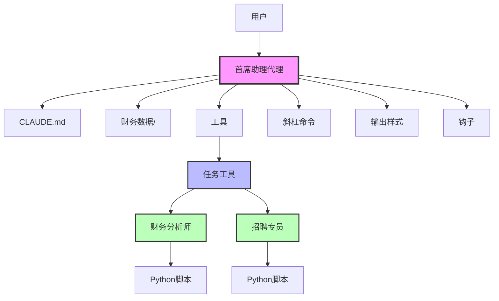
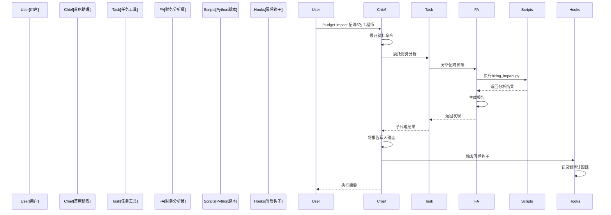

# 首席助理代理架构

## 预期的代理通信流程

  根目录文件

  1. agent.py - 首席助理代理主文件
  2. CLAUDE.md - 公司背景和上下文文档
  3. flow_diagram.md - 架构流程图文档

  scripts/ 目录（5个Python文件）

  1. simple_calculation.py - 简单财务计算器
  2. financial_forecast.py - 财务预测工具
  3. hiring_impact.py - 招聘影响计算器
  4. talent_scorer.py - 人才评分工具
  5. decision_matrix.py - 决策矩阵工具

  output_reports/ 目录（2个markdown文件）

  1. hiring_decision.md - 招聘决策预算影响分析报告
  2. Q2_2024_Financial_Forecast.md - 2024年第二季度财务预测报告

  .claude/ 目录（10个文档文件）

  agents/ 子目录：
  1. financial-analyst.md - 财务分析师代理文档
  2. recruiter.md - 招聘专员代理文档

  commands/ 子目录：
  1. budget-impact.md - 预算影响分析命令
  2. strategic-brief.md - 战略简报命令
  3. talent-scan.md - 人才扫描命令
  4. slash-command-test.md - 斜杠命令测试

  hooks/ 子目录：
  1. report-tracker.py - 报告跟踪钩子
  2. script-usage-logger.py - 脚本使用日志钩子

  output-styles/ 子目录：
  1. executive.md - 高管输出样式
  2. technical.md - 技术输出样式

