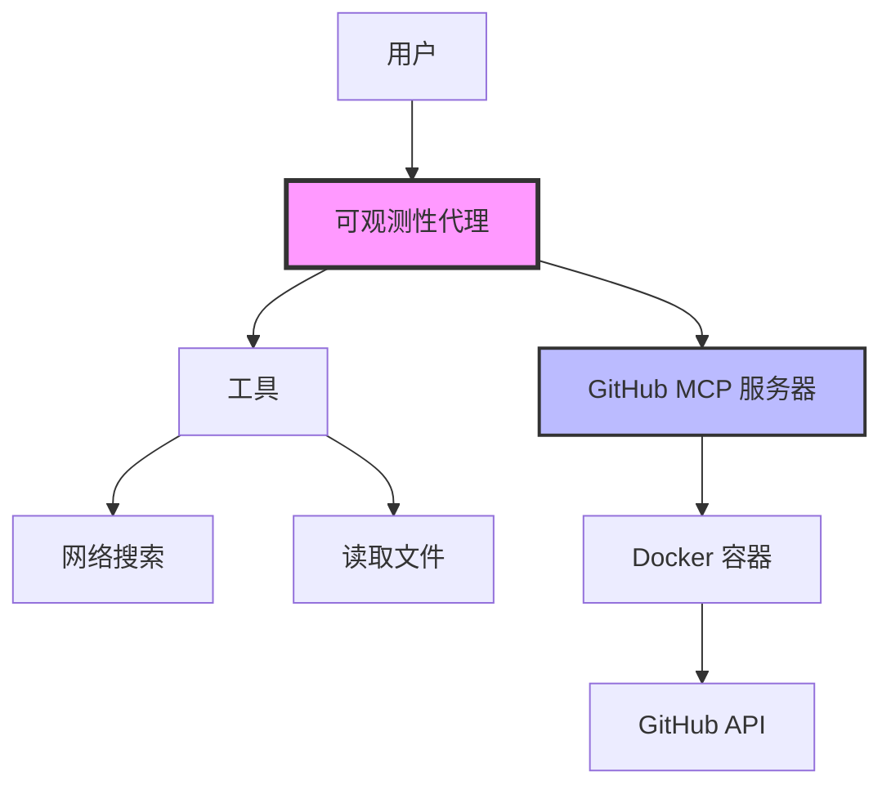
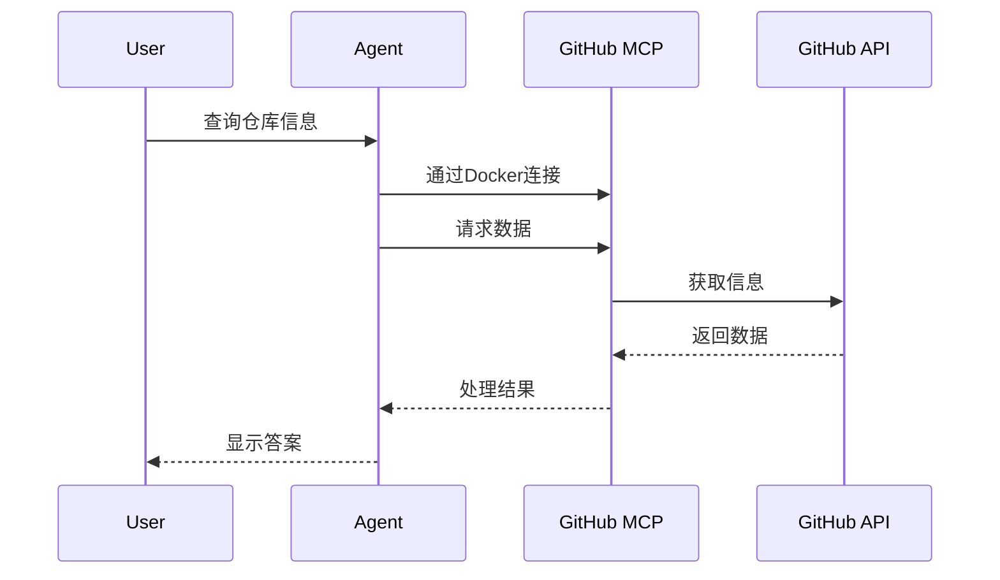

# 可观测性代理架构

```mermaid
graph TD
    User[用户] --> Agent[可观测性代理]
    Agent --> GitHub[GitHub MCP 服务器]

    Agent --> Tools[工具]
    Tools --> WebSearch[网络搜索]
    Tools --> Read[读取文件]

    GitHub --> Docker[Docker 容器]
    Docker --> API[GitHub API]

    style Agent fill:#f9f,stroke:#333,stroke-width:3px
    style GitHub fill:#bbf,stroke:#333,stroke-width:2px
```

# 通信流程图

```mermaid
sequenceDiagram
    participant User
    participant Agent
    participant MCP as GitHub MCP
    participant API as GitHub API

    User->>Agent: 查询仓库信息
    Agent->>MCP: 通过Docker连接
    Agent->>MCP: 请求数据
    MCP->>API: 获取信息
    API-->>MCP: 返回数据
    MCP-->>Agent: 处理结果
    Agent-->>User: 显示答案
```
