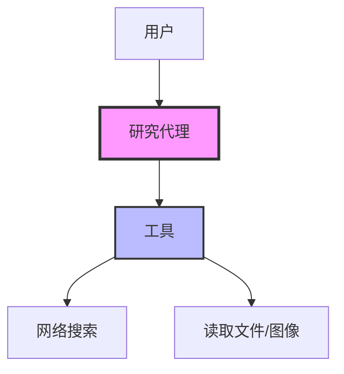
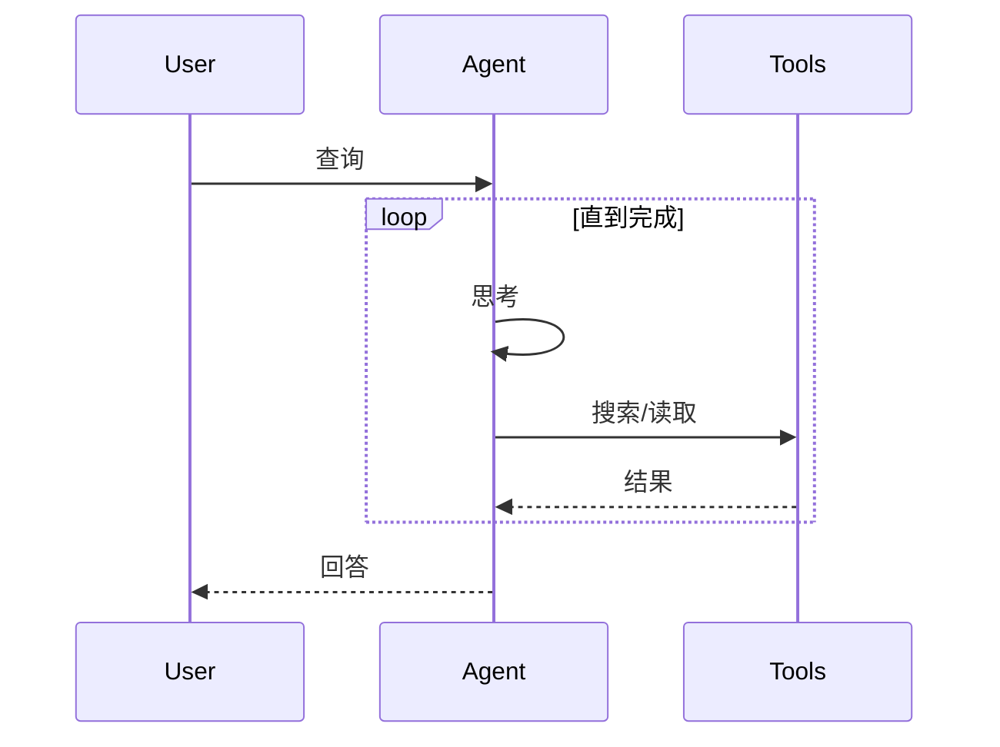

# 研究代理架构

```mermaid
graph TD
    User[用户] --> Agent[研究代理]
    Agent --> Tools[工具]

    Tools --> WebSearch[网络搜索]
    Tools --> Read[读取文件/图像]

    style Agent fill:#f9f,stroke:#333,stroke-width:3px
    style Tools fill:#bbf,stroke:#333,stroke-width:2px
```

# 通信流程图

```mermaid
sequenceDiagram
    participant User
    participant Agent
    participant Tools

    User->>Agent: 查询

    loop 直到完成
        Agent->>Agent: 思考
        Agent->>Tools: 搜索/读取
        Tools-->>Agent: 结果
    end

    Agent-->>User: 回答
```
